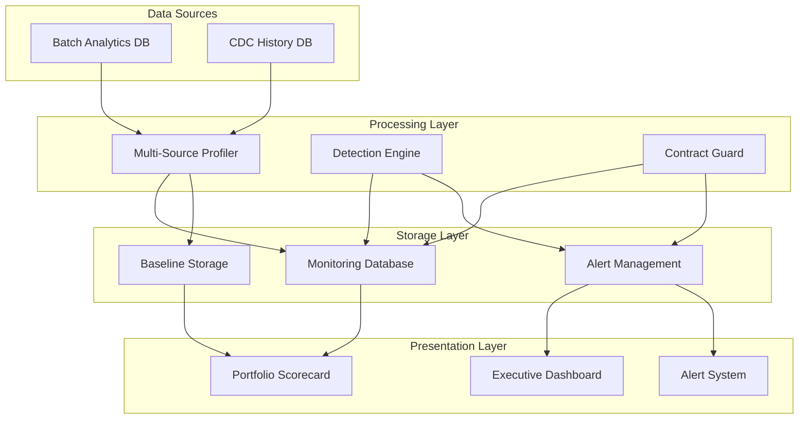

# Architecture Diagram Placeholder

This file serves as a placeholder for the architecture diagram image.

## How to Create the Architecture Diagram

1. **Tool Recommendations:**
   - Draw.io (diagrams.net) - Free web-based diagramming
   - Lucidchart - Professional diagramming tool
   - Mermaid + Markdown - Code-based diagrams
   - PlantUML - Text-based UML diagrams

2. **Diagram Components to Include:**
   - Data Sources (Batch Analytics DB, CDC History DB)
   - Processing Components (Profiler, Detector, Contract Guard)
   - Storage Layer (Monitoring DB, Baselines, Alerts)
   - Presentation Layer (Scorecard, Dashboard, Reports)
   - Data flow arrows between components
   - External integrations (webhooks, alerts)

3. **Styling Guidelines:**
   - Use consistent color scheme (blue for data, green for processing, red for alerts)
   - Clear labels and legends
   - Professional appearance suitable for technical documentation
   - Include technology stack labels

4. **File Format:**
   - Save as PNG for README compatibility
   - Maintain high resolution (minimum 1200x800 pixels)
   - Keep file size reasonable (< 500KB)

## Current Status

⚠️ **Architecture diagram needed** - Replace this placeholder with an actual architecture diagram image named `architecture-diagram.png`

## Temporary Alternative

While waiting for the diagram, you can use this Mermaid code in README.md:

